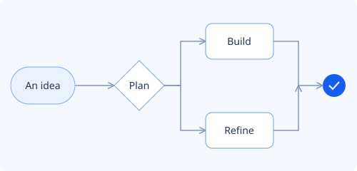

#  OpenChart

**Architecture diagrams you own. Edit visually or through an agent, then export for your next presentation.**

[](https://github.com/jacks3tr/open-chart/actions/workflows/ci.yml)
[](LICENSE)


OpenChart is an open-source, local diagram editor for architecture, integration,
and system-connectivity maps. The Windows app, CLI, and MCP interface share one
JSON document model and one undoable operation engine. No accounts, cloud sync,
or collaboration service. Your diagrams stay in files you control.



*From thought to flow.*

> **Early preview:** build from source with the instructions below. Windows is
> the supported desktop platform. The browser editor is available for local
> development; it is not a hosted service.

## Try it locally

Install **Node.js 24 or later**, npm, and Git. In PowerShell:

```powershell
git clone https://github.com/jacks3tr/open-chart.git
cd open-chart
npm ci
npm run dev --workspace @openchart/app
```

Open the loopback URL printed by Vite. Choose **Start from template** for an
approval flow, order fulfillment platform, AWS application, domain model, or
segmented network. You can also open
[`examples/northstar-integration.openchart.json`](examples/northstar-integration.openchart.json).

### Windows desktop app

Install Rust with the MSVC toolchain, Microsoft C++ Build Tools with the
**Desktop development with C++** workload, and the WebView2 Runtime. Follow the
[Tauri Windows prerequisites](https://v2.tauri.app/start/prerequisites/#windows)
for installation details.

```powershell
npm run desktop:dev
```

To build the local executable:

```powershell
npm run desktop:build
```

The binary is `apps/desktop/src-tauri/target/release/openchart-desktop.exe`.
This command builds the executable without an installer bundle.

## What you can do

| Capability | Included |
| --- | --- |
| Draw and organize | Pages, layers, groups, containers, ports, and editable labels |
| Start with useful examples | Five templates with editable headings and presentation layouts |
| Use diagram notation | Flowchart, BPMN, UML, ERD, network, integration, and cloud symbols; 5,000+ searchable shapes and icons |
| Refine the layout | Alignment, distribution, pinned positions, and routed connectors |
| Preview a Beauty Pass | Compare before and after, then apply one undoable edit |
| Work with an agent | MCP and CLI mutations through the same document model |
| Share the result | SVG, PNG, JPEG, PDF, PowerPoint, D2, and Mermaid exports |

**Beauty Pass** infers roles, arranges unpinned shapes, tidies connectors, and
applies styling. Review the preview before applying it. Manually positioned
shapes retain their positions. Selection passes preserve objects and shared
styles outside the selection; page passes protect styles used elsewhere.
Cancel leaves the document unchanged, and one undo reverses an applied pass.

**Export** operates on the active page and includes content beyond the original
artboard. Native exports use a Save dialog; browser exports download files.
SVG preserves object hyperlinks. PowerPoint contains SVG artwork with a PNG
fallback, not individually editable PowerPoint shapes. D2 and Mermaid are text
projections with reported fidelity limitations; use `.openchart.json` to retain
the full editable document.

## CLI and MCP

Run commands from the repository root after `npm ci`:

```powershell
# Export the included example to a new file.
npm run openchart -- export svg ./examples/northstar-integration.openchart.json ./diagram.svg

# Apply an operation envelope to your own document.
npm run openchart -- apply ./ops.json ./diagram.openchart.json

# Serve a document through MCP over standard input/output.
npm run openchart -- mcp --stdio ./diagram.openchart.json
```

`ops.json` is an operation envelope, not a replacement document. Successful
file mutations write a journal and replace the document atomically. Failures
produce structured JSON on stderr. CLI export refuses to overwrite an existing
output file.

The native app exposes its live document through an authenticated loopback MCP
host. Discovery information, including a bearer token, lives in
`%LOCALAPPDATA%/OpenChart/mcp.json`. Treat that file as a credential and do not
share it. See [SECURITY.md](SECURITY.md) for the trust boundary and reporting guidance.

## Project structure

This is an npm workspace monorepo. Rust hosts the Windows window, authentication,
and filesystem bridge; TypeScript owns diagram semantics.

| Path | Responsibility |
| --- | --- |
| `apps/desktop` | Tauri Windows host |
| `packages/app` | React editor and local browser entry point |
| `packages/ir`, `packages/ops` | Document schema, validation, transactions, and undo |
| `packages/derive`, `packages/connectors` | Layout, styling, and routing |
| `packages/shapes`, `packages/vendor-packs` | Shape definitions and catalog metadata |
| `packages/scene`, `packages/render`, `packages/serialize` | Shared scene, canvas rendering, and exports |
| `packages/interact` | Selection, transforms, clipboard, and commands |
| `packages/persistence`, `packages/agent` | File persistence, CLI, and MCP |
| `examples`, `docs`, `scripts` | Sample documents, documentation, and verification tools |

See the [shape catalog](docs/SHAPE_CATALOG.md),
[editor reliability notes](docs/EDITOR_RELIABILITY.md), and
[performance methodology](docs/PERFORMANCE_PASS_2026-09-05.md).
The [original design](docs/OPENCHART_PLAN.md) and
[Phase 9 roadmap](docs/PHASE_9_PLAN.md) are historical planning references,
not promises of shipped features or measured performance.

## Contributing

Bug reports, documentation improvements, and focused pull requests are welcome.
Start with [CONTRIBUTING.md](CONTRIBUTING.md) for setup, verification, and the
contribution workflow. Run `npm run check` and `npm run build` before submitting
code; CI also checks browser interactions, fuzzing, performance, and the desktop build.

Current limitations include per-range rich text, additional import formats,
individually editable PowerPoint exports, and signed installers. There is no
account service, cloud synchronization, or multiplayer editing.

Please follow the [Code of Conduct](CODE_OF_CONDUCT.md), and use
[security reporting guidance](SECURITY.md) for sensitive findings.

## License and artwork

OpenChart is [MIT licensed](LICENSE). Native diagram symbols are original
OpenChart vectors; cloud symbols are not official vendor icon reproductions.
Simple Icons and Phosphor retain upstream provenance and license metadata in the
catalog. Brand names and logos belong to their respective owners.

The interface and starter diagrams use locally bundled IBM Plex Sans and Plex Mono,
licensed under the [SIL Open Font License](packages/scene/fonts/OFL.txt).
